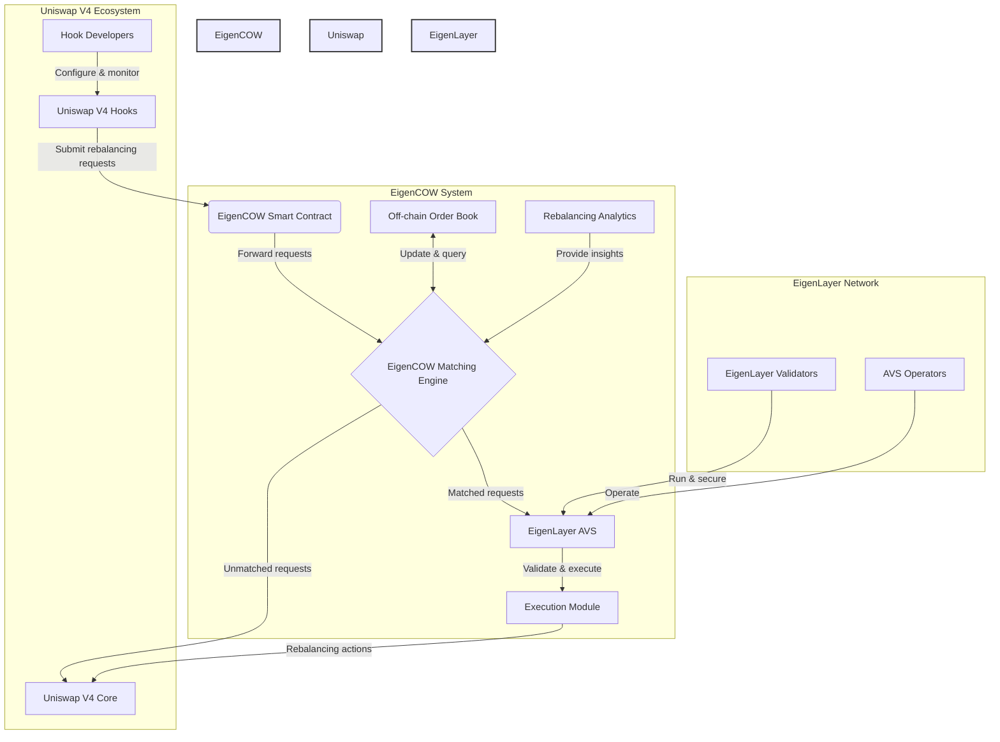
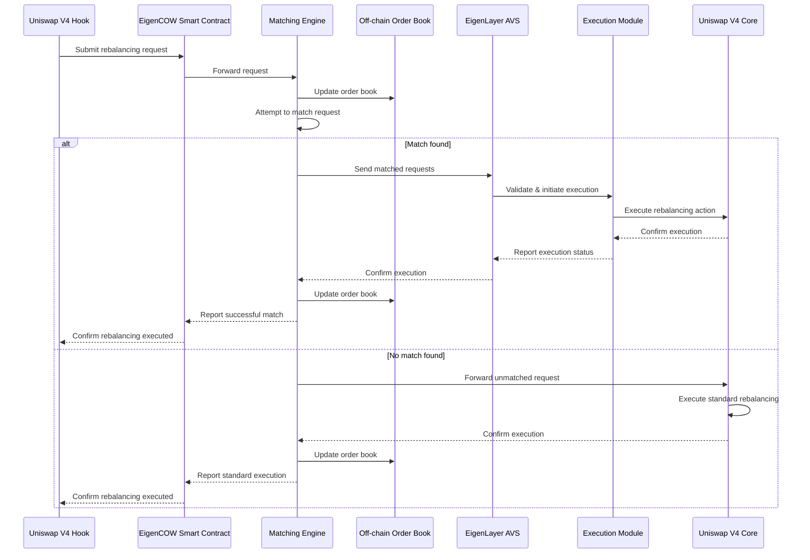

# EigenCOW: MEV-Resistant Hook Rebalancing for Uniswap V4 on EigenLayer

EigenCOW is a decentralized Coincidence of Wants (CoW) matching engine built on EigenLayer, designed to efficiently rebalance hooks in Uniswap V4 while minimizing Miner Extractable Value (MEV). By leveraging off-chain matching, EigenLayer's security, and innovative MEV-resistant techniques, EigenCOW optimizes hook rebalancing, reducing fees, minimizing price impact, and protecting users from value extraction.

## Problem Statement

In Uniswap V4, hooks introduce powerful customization options but also create new challenges:

1. **Complex Position Management**: Hooks can represent a wide variety of financial positions, including but not limited to:
   - Lending positions with varying interest rates and collateral requirements
   - Derivative positions such as options or futures
   - Yield farming strategies across multiple protocols
   - Cross-chain liquidity positions
   These complex positions often require frequent and intricate rebalancing to maintain optimal performance and risk parameters.

2. **Rebalancing Inefficiencies**: Traditional rebalancing of these complex positions can lead to:
   - High gas fees due to multiple, separate transactions
   - Significant price impact, especially for larger positions
   - Missed opportunities for netting complementary rebalancing needs across different hooks

3. **MEV Vulnerability**: Predictable rebalancing patterns of these diverse hook positions make them vulnerable to MEV extraction, potentially harming users and reducing overall market efficiency. This is especially problematic for:
   - Time-sensitive positions like options nearing expiry
   - Positions with known liquidation thresholds
   - Regularly scheduled rebalancing of index-based positions

4. **Liquidity Fragmentation**: As hooks enable more specialized liquidity pools, there's a risk of liquidity becoming fragmented across numerous small pools, reducing overall market efficiency and increasing slippage for users.

5. **Cross-Hook Dependencies**: Some hook positions may have dependencies on or interactions with other hooks, creating complex rebalancing scenarios that are difficult to optimize manually or through traditional automated systems.

## Our Solution

EigenCOW addresses these challenges by:

1. Identifying complementary rebalancing needs across multiple Uniswap V4 hooks, regardless of the complexity of the underlying positions.
2. Matching these needs off-chain to reduce on-chain transactions and associated fees.
3. Minimizing price impact by directly matching rebalancing actions between hooks, even for complex or large positions.
4. Leveraging EigenLayer's AVS (Actively Validated Service) for secure and decentralized execution.
5. Implementing innovative MEV-resistant strategies to protect users and enhance market efficiency.

## How EigenCOW Works

1. Uniswap V4 hooks submit rebalancing requests to EigenCOW, specifying token pairs and amounts.
2. EigenCOW's matching engine, run by AVS operators, analyzes the rebalancing needs.
3. Complementary rebalancing actions are identified and matched off-chain.
4. AVS operators execute the matched rebalancing actions, bypassing traditional swap routes when possible.
5. Any unmatched or partially filled rebalancing needs are routed to Uniswap V4 for standard execution.
6. Throughout the process, MEV minimization strategies are applied to protect users and ensure fair execution.

## MEV Minimization Strategies

EigenCOW incorporates several innovative mechanisms to significantly reduce MEV opportunities:

1. **Coincidence-of-Wants (CoW) Matching**:
   - Before on-chain execution, EigenCOW identifies complementary rebalancing needs among different hooks.
   - By matching these needs off-chain, we reduce the number of on-chain transactions, minimizing MEV extraction opportunities.

2. **Batched Executions**:
   - Multiple rebalancing operations are bundled and executed in a single transaction.
   - This batching makes it harder for MEV bots to target individual rebalancing actions.

3. **Randomized Execution Timing**:
   - The exact timing of rebalancing executions is slightly randomized within a predetermined window.
   - This randomization reduces the predictability that MEV bots often exploit.

4. **Decentralized Execution via EigenLayer**:
   - By leveraging EigenLayer's network of validators, the responsibility for initiating rebalancing is distributed.
   - This distribution makes it harder for any single entity to consistently front-run rebalancing actions.

5. **Private Order Flow**:
   - Matched rebalancing actions are executed directly between parties.
   - This approach bypasses the public mempool, reducing visibility to MEV bots.

## Technical Architecture

The following diagram illustrates the key components and interactions of the EigenCOW system:



## Sequence Diagram

The following sequence diagram illustrates the flow of operations in EigenCOW:



## Key Benefits

1. **Reduced Gas Fees**: Off-chain matching significantly reduces on-chain transaction fees.
2. **Minimized Price Impact**: Direct matching between hooks eliminates the need to route large rebalancing actions through AMM pools.
3. **Enhanced Efficiency**: Coordinated rebalancing across multiple hooks optimizes liquidity utilization.
4. **Improved Hook Performance**: More frequent and cost-effective rebalancing leads to better-performing Uniswap V4 hooks.
5. **Decentralized Security**: Leverages EigenLayer's robust security model and decentralized validator network.
6. **MEV Protection**: Innovative strategies significantly reduce the risk of value extraction, protecting users and enhancing market fairness.
7. **Increased Market Efficiency**: By reducing MEV, EigenCOW helps maintain more accurate pricing and liquidity distribution.

## Use Cases

1. **Automated Market Maker (AMM) Hooks**: Efficiently rebalance liquidity across different price ranges with MEV protection.
2. **Yield Farming Hooks**: Optimize asset allocation based on changing yield opportunities while minimizing front-running risks.
3. **Arbitrage Hooks**: Quickly capitalize on price discrepancies across different pools or exchanges without exposing strategies to MEV bots.
4. **Risk Management Hooks**: Adjust positions to maintain desired risk parameters with minimal market impact and MEV exposure.

## Installation and Setup

### Documentation

https://book.getfoundry.sh/

### Build

```shell
$ forge build
```

### Format

```shell
$ forge fmt
```

### Gas Snapshots

```shell
$ forge snapshot
```

### Anvil

```shell
$ anvil
```

## Usage Guide

### Test all project
```
make test_all
```

### Test call option
```
make test_core
```
### Test AVS task manager
```
make test_avs
```


## Future Roadmap

1. Integration with additional DeFi protocols beyond Uniswap V4
2. Implementation of advanced rebalancing strategies and algorithms
3. Enhanced privacy features using zero-knowledge proofs for sensitive rebalancing actions
4. Cross-chain rebalancing capabilities for multi-chain Uniswap V4 deployments
5. Development of a simulation environment for hook developers to test rebalancing strategies
